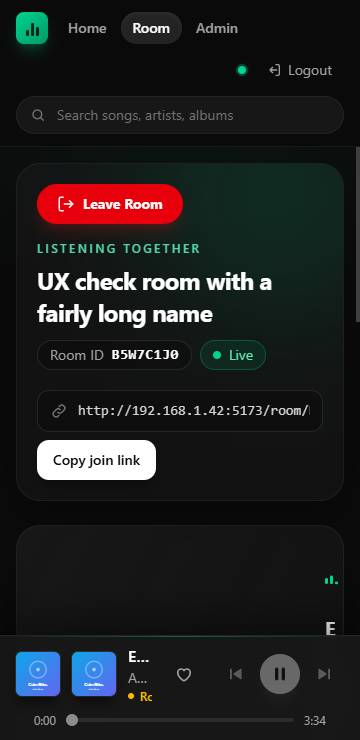
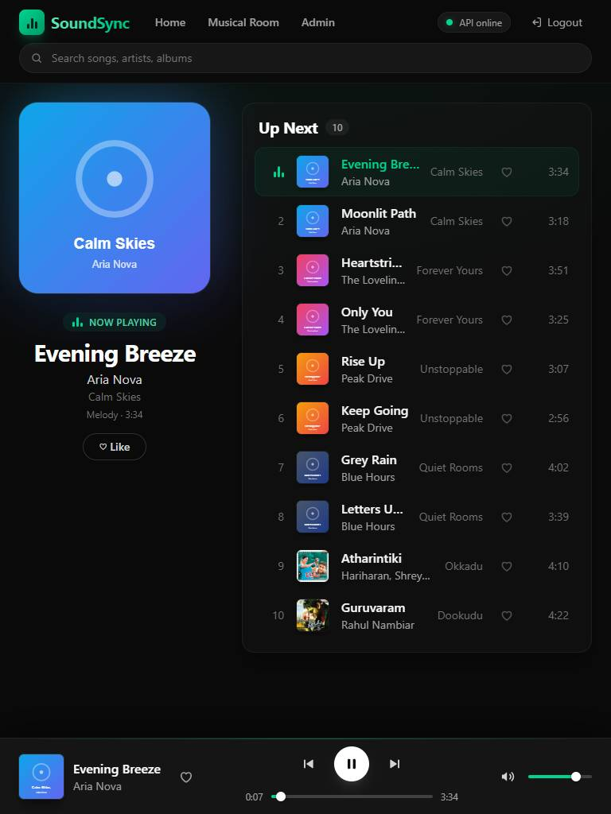
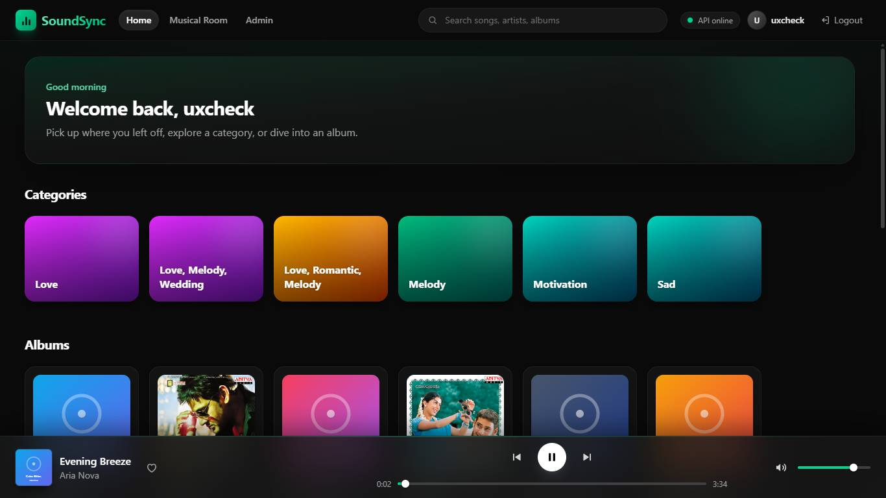
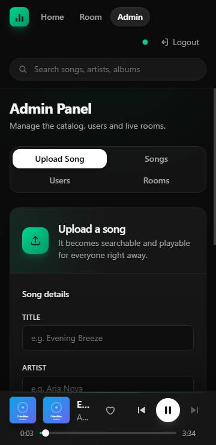
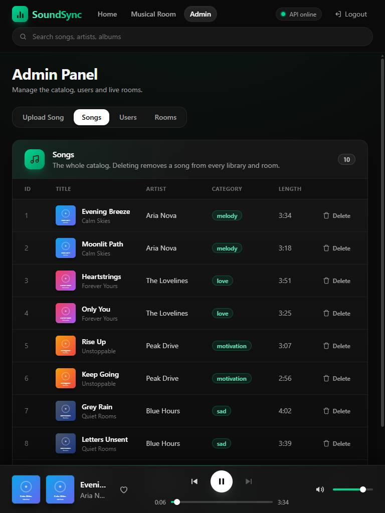
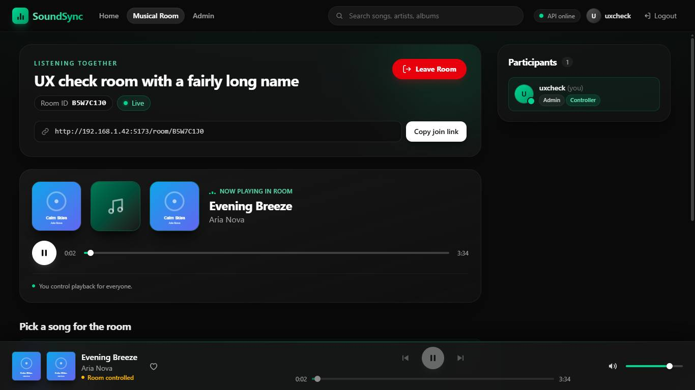

# UI/UX Review for UAT (FE, Phase 8)

Handbook Phase 8: "FE: UI/UX defect burn-down. Deliverable: player, room, and admin UX clearly functional. Done when: UX signed off for UAT."

Release **1.0.0**, reviewed 2026-10-07. Defects found here are tracked in [`defect_log.md`](defect_log.md); usage of each screen is in [`ui_guide.md`](../../../frontend/docs/ui_guide.md).

## Result

**Signed off for UAT.** Every main screen passed every automated layout and accessibility check at phone, tablet and desktop size (33 of 33), the real-browser journey passed three times in a row, and the screenshots below were reviewed by eye. All five UI/UX defects found (D-12, D-13, D-14, D-16, D-17) are fixed; none is open.

## Method

1. **Automated screen check**: `python -m scripts.ux_check` (API, frontend and seed data running). It drives one logged-in user in headless Edge through 11 screens at 3 sizes and checks on each:

   | Check | Rule |
   | --- | --- |
   | No sideways page scroll | The page is never wider than the screen |
   | Nothing cut off | No element sticks out past the screen edge, unless it sits inside its own scrolling box (wide admin tables) |
   | Player never hides content | The last item on the page can be scrolled clear of the footer player |
   | Every control has a name | Each button, link and input has visible text, a label or `aria-label` (what screen readers read out) |
   | Easy to tap | Buttons and sliders are at least 24 px tall and wide (WCAG 2.2 target size) |
   | No script errors | No uncaught error or rejected promise while the screen loads |

   Sizes: phone 360 × 740, tablet 768 × 1024, desktop 1366 × 768. Screens: login, register, home (song playing), album, now playing, room landing, room (controlling playback), admin upload, admin songs, admin users, admin rooms. The user it creates is removed afterwards. Because the screenshots are committed, accounts and rooms that are not seed or check data are masked (`user@example.com`, "Another room") after the checks and before the screenshot.
2. **Visual review** of the 33 screenshots it saves to [`ux/`](ux/).
3. **Behaviour**: `python -m scripts.browser_e2e` (two real browsers through login, play, room sync, transfer, leave and admin) and the frontend test suite (`npm test`, 189 tests).

## Results

| Screen | Phone | Tablet | Desktop | What was confirmed by eye |
| --- | --- | --- | --- | --- |
| Login | Pass | Pass | Pass | Labelled fields; error announced to screen readers |
| Register | Pass | Pass | Pass | Same; password managers offer a new password |
| Home | Pass | Pass | Pass | Categories, albums, liked and recent rows; footer player clear of content |
| Album | Pass | Pass | Pass | Cover, song count and length, Play all; playing song marked in the list |
| Now Playing | Pass | Pass | Pass | Song title readable in the footer at every size (D-17) |
| Room landing | Pass | Pass | Pass | Create and join forms side by side on desktop, stacked on phone |
| Room | Pass | Pass | Pass | Room ID, Live status, join link with copy button, red Leave Room, room player, participants |
| Admin: Upload | Pass | Pass | Pass | File pickers look like buttons (D-16); size limits shown |
| Admin: Songs | Pass | Pass | Pass | Table scrolls inside its box on phones; Delete asks for confirmation |
| Admin: Users | Pass | Pass | Pass | Role badges; no password data |
| Admin: Rooms | Pass | Pass | Pass | Active rooms only, newest first |

`ux_check` output: `33/33 screen x viewport checks passed.`

## Screens

| Phone | Tablet | Desktop |
| --- | --- | --- |
|  |  |  |
|  |  |  |

All 33 screenshots: [`ux/`](ux/) (`{screen}-{phone|tablet|desktop}.jpg`).

## UI/UX defects fixed in Phase 8

| ID | Problem | Fix |
| --- | --- | --- |
| D-12 | Login and register fields had only placeholders, no autofill hints, and errors were not announced | Field names, `autocomplete`, errors as `role="alert"` |
| D-13 | Logout button and all sliders (seek, volume, room seek) were smaller than 24 px | Larger tap areas |
| D-14 | Two frontend tests failed now and then on a busy machine | Tests made robust (3 full runs green) |
| D-16 | Upload file pickers looked like plain text | Styled as buttons |
| D-17 | Footer player cut the song title to a few letters on tablets | Volume column only takes the space it needs |

## Accepted for UAT (not defects)

- Wide admin tables scroll sideways inside their own box on phones; the page itself never does.
- A phone browser may block audio until the first tap; the room shows **Tap to hear the room**.
- `npm run lint` reports 4 warnings (React fast-refresh and compiler hints), no errors.

## Sign-off

| Lead | Team | Signed | Date | Notes |
| --- | --- | --- | --- | --- |
| Eshwar (saladieshwar) | FE | Yes | 2026-10-07 | Player, room and admin UX clearly functional at every size |
| Eshwar (saladieshwar) | QA | Yes | 2026-10-07 | UX signed off for UAT |
